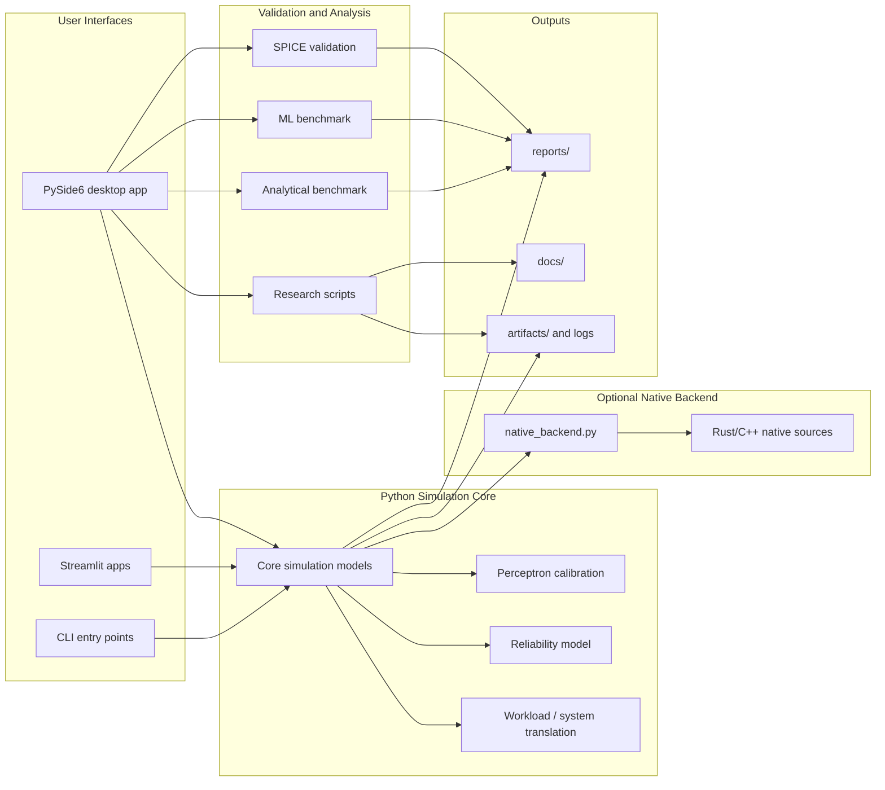
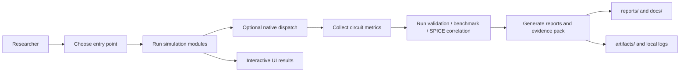

# SRAM Simulator with Perceptron

Public research snapshot of an SRAM reliability exploration codebase built around perceptron-based surrogate models, SPICE correlation, model selection, and node-scaling analysis.

## Public Scope

This repository is intentionally trimmed for public release.

Included:
- executable source code
- retained SPICE validation code, configs, templates, and calibration assets
- selected documentation
- 5 representative report snapshots

Excluded:
- large generated result archives
- local logs and bundle outputs
- build artifacts and binaries
- private or application-facing material

## Included Representative Snapshots

The public snapshot keeps these report artifacts:

- `docs/research_evidence_pack.md`
- `reports/gate_b_summary_n27_xyce_contractfix_20260309.md`
- `reports/matrix_parallel_benchmark_20260218c.md`
- `reports/node_scaling_report_n27_xyce_20260218.md`
- `reports/pdk_phase2_n27_xyce_contractfix_20260309/model_selection_sky130_spice_v2_n27_xyce_contractfix_20260309.md`
- `reports/raw_metric_span_audit_n27_xyce_contractfix_20260309.md`

These are representative snapshots only. The full experimental dump is intentionally not bundled here.

## Repository Layout

- `main.py`, `main_advanced.py`: simulation entry points
- `pyside_sram_app_advanced.py`: desktop UI
- `streamlit_app*.py`: Streamlit interfaces
- `ml_benchmark.py`: model benchmarking logic
- `spice_validation/`: SPICE correlation runner, configs, templates, calibration data
- `scripts/`: public helper scripts for evidence pack export and report generation
- `docs/`: selected public documentation
- `reports/`: representative public report snapshots
- `native/`: native backend source only

## Technical Stack

This public research snapshot is built around a Python-first simulation and validation stack, with optional layers for interactive UI, SPICE correlation, native acceleration, machine-learning benchmarking, and report generation. The repository is designed so the core simulation paths remain usable with the minimum scientific Python dependencies, while advanced workflows are enabled by optional packages and external tooling.

| Layer | Technologies | Usage in Repo |
| --- | --- | --- |
| Core runtime | `Python` | Primary implementation language for simulation, validation, UI orchestration, and scripting |
| Scientific computing | `NumPy`, `SciPy` | Numerical simulation, statistics, Monte Carlo analysis, and analytical modeling |
| Visualization and UI | `Matplotlib`, `Streamlit`, `PySide6` | Plotting, browser-based exploration, and desktop application interfaces |
| ML and benchmarking | `scikit-learn` | Benchmarking surrogate models and comparing regression approaches |
| AI-assisted analysis | `OpenAI SDK`, `python-dotenv` | Optional research-data analysis and AI-assisted recommendations |
| Validation and correlation | `ngspice`, `PDK configs/templates` | SPICE correlation, PDK-driven validation, and regression checks |
| Native acceleration | `Rust`, `C++`, optional `_sram_native` | Native backend kernels and integration scaffolding for faster execution paths |
| Reporting and packaging | `ReportLab`, `Markdown`, `CSV` | Report export, evidence-pack generation, and lightweight result packaging |

Note: `requirements.txt` covers the minimum Python dependencies, while advanced UI, ML, AI, native, and reporting features are optional.

## System Architecture

At a high level, this repository follows an `entry points -> Python simulation core -> optional native/validation -> reports/artifacts` structure. Multiple user-facing entry points feed into a shared simulation layer, which can be extended by calibration, reliability analysis, workload translation, validation workflows, and optional native execution paths. Outputs then flow into local reports, documentation snapshots, and research artifacts.

### System Overview



### Execution and Validation Flow



## Quick Start

```powershell
python -m venv .venv
.\.venv\Scripts\activate
pip install -r requirements.txt
```

Optional packages:

```powershell
pip install scikit-learn
pip install PySide6
pip install openai python-dotenv
pip install reportlab
```

## Run

Core simulation:

```powershell
python main.py
python main_advanced.py
python hybrid_perceptron_sram.py
python adaptive_perceptron_sram.py
python reliability_model.py
python workload_model.py
```

UI:

```powershell
streamlit run streamlit_app.py
streamlit run streamlit_app_advanced.py
streamlit run streamlit_app_unified.py
python pyside_sram_app_advanced.py
```

Validation and report generation:

```powershell
python spice_validation/run_spice_validation.py --spice-source placeholder
python scripts/run_pdk_matrix.py
python scripts/run_model_selection.py
python scripts/run_node_scaling.py
python scripts/build_research_evidence_pack.py
python scripts/export_research_bundle.py --tag public_snapshot --skip-zip
```

## Research Data and Local Outputs

The UI keeps local, non-versioned outputs such as:

- `research_data.json`
- `logs/research_analysis_<timestamp>.json`
- `logs/research_analysis_<timestamp>.log`
- `artifacts/research_bundle_<tag>/`

These are intentionally ignored in this public repository.

## Notes

- This repository is positioned for research, reproducibility, and technical evidence sharing.
- It does not present a full experimental archive.
- Representative report snapshots may summarize runs whose full raw outputs are not bundled here.

## Additional Docs

- `README_ADVANCED.md`
- `USAGE_UNIFIED.md`
- `docs/pdk_validation_criteria.md`
- `docs/pdk_phase45_status_2026-02-18i.md`
- `docs/phase23_pass_subset_execution_2026-03-09_n27_contractfix.md`
- `docs/open_source_reliability_roadmap_2026-03-09.md`
